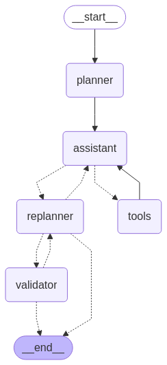

# HuggingFace Agents Course Final Assignment
- https://huggingface.co/learn/agents-course/unit4/hands-on
- `main.py` contains the main program

## Implementation details
- Implemented using LangGraph with following agents:

- LLM inference on Azure AI Foundry
    - Except for replanning agent, that uses OpenAI API directly, due to Azure Content filter that stopped at least 2 questions
- Monitoring using LangSmith

## Outstanding issues
- Python REPL gets stuck on one question
- Getting stuck on infinite loop with web search - improve with assisstant prompt
- YouTube video with images
```
Task ID: a1e91b78-d3d8-4675-bb8d-62741b4b68a6
Question: In the video https://www.youtube.com/watch?v=L1vXCYZAYYM, what is the highest number of bird species to be on camera simultaneously?
```

## Resources
- Leaderboard and codes: https://huggingface.co/spaces/agents-course/Students_leaderboard
    - 1 good example: https://huggingface.co/spaces/cellerson/AgentCourseFinalProject/tree/main
- GitHub models: https://github.com/marketplace?type=models
- LangGraph planning: https://github.com/langchain-ai/langgraph/blob/main/docs/docs/tutorials/plan-and-execute/plan-and-execute.ipynb